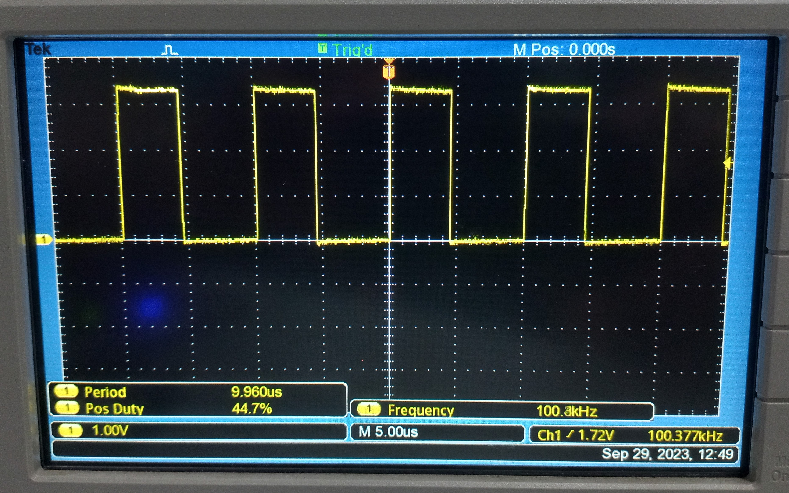

# Lab 7: PWM Generation with real time varying duty cycle

Group 11: EE23DP001 Aditya Shirodkar; EE23MS006 Prasanth Pithanisetty

## Aim:
To Generate PWM signals which can be varied in real-time using user switches.
The programs to be implemented are as follows:
1. Create a PWM signal on 100KHz with an initial duty cycle of 50%. On pressing one user switch, the duty cycle should increase by 5%, while on pressing the other, the duty cycle should decrease by 5%.
2. Create a PWM signal on 100KHz with an initial duty cycle of 50%. On pressing a user switch for a short duration, the duty cycle should increase by 5%, while for a long press, the duty cycle should decrease by 5%.

## Procedure:
PWM signal generation is done on Port F, Pin PF2 (Connected to onboard Blue LED).
1. Enable clock to GPIO Port F
2. Configure Port F such that onboard LEDs are inputs and onboard user switches are outputs
3. Configure interrupts for Port F
4. Enable clock to PWM module
5. Configure pin PF2 for PWM functionality
6. Configure PWM module registers to generate the desired PWM signal on port F
7. Configure Systick and its interrupt (for task 2)

## PWM Generation:
The TM4C123GH6PM microcontroller contains two PWM modules, each with four PWM generator blocks and a control block, for a total of 16 PWM outputs. The control block determines the polarity of the PWM signals, and which signals are passed through to the pins. Each PWM generator block produces two PWM signals that share the same timer and frequency and can either be programmed with independent actions or as a single pair of complementary signals with dead-band delays inserted.

## Algorithms:
Each algorithm incorporates debounce inorder to prevent unnecessary triggering of duty cycle change.

### Task 1 (2 user switches):
* User Switch 1 decreases duty cycle by 5%, User Switch 2 increases duty cycle by 5%.
* Pressing any user switch triggers an interrupt, and based on the particular switch pressed, further action is taken.
* Duty cycle range is limited between 5% and 95%.

*State Diagram of Task 1*

### Task 2 (1 user switch):
* User Switch short press increases duty cycle by 5%, User Switch long press decreases duty cycle by 5%.
* Pressing any user switch triggers an interrupt, where systick is enabled with a count duration of 1 second.
* When systick counts to zero, an interrupt is triggered. Here, the user switch position is checked.
	- If switch is still being pressed, long press action is triggered
	- if switch has been released, short press action is triggered 
* Duty cycle range is limited between 5% and 95%.
* The algorithm works on pressing any user switch. A particular user switch can be defined for this program if required.

*State Diagram of Task 2*

## Codes:
### Task 1 (2 user switches):

	#include <stdint.h>
	#include <stdbool.h>
	#include "tm4c123gh6pm.h"

	//Using M1PWM6, on Pin PF2; controlled by M1PWM6, controlled by Module 1 PWM Generator 3.

	void PortFConfig(void);
	void PWMConfig(void);
	void two_switch(void);
	//void GPIOF_Handler(void);

	#define frequency 100000
	#define time_period (16000000/frequency)
	#define del_duty 5
	volatile int duty;

	#define Sw_Bits 0x11

	void main(void)

	{
	    PortFConfig();
	    PWMConfig();
	    duty=50;
	    PWM1_3_CMPA_R = (time_period * duty) / 100;     //Provide initial duty to pwm
	    while(1){}
	}

	void PortFConfig(void)
	{
	    SYSCTL_RCGCGPIO_R |= (1<<5);        //Enable and provide a clock to GPIO Port F
	    GPIO_PORTF_LOCK_R = 0x4C4F434B;     //Unlock PortF register
	    GPIO_PORTF_CR_R = 0x1F;             //Enable Commit function

	    GPIO_PORTF_PUR_R = 0x11;            //Pull-up for user switches
	    GPIO_PORTF_DEN_R = 0x1F;            //Enable all pins on port F
	    GPIO_PORTF_DIR_R = 0x0E;            //Define PortF LEDs as output and switches as input

	    //PortF Interrupt Configurations: User Sw should trigger hardware interrupt
	    GPIO_PORTF_IS_R &= ~Sw_Bits;        //Edge trigger detected
	    GPIO_PORTF_IBE_R &= ~Sw_Bits;       //Trigger interrupt according to GPIOIEV
	    GPIO_PORTF_IEV_R &= ~Sw_Bits;       //Trigger interrupt on falling edge
	    GPIO_PORTF_IM_R &= ~Sw_Bits;        //Mask interrupt bits
	    GPIO_PORTF_ICR_R |= Sw_Bits;        //clear any prior interrupts
	    GPIO_PORTF_IM_R |= Sw_Bits;         //enable interrupts for bits corresponding to Mask_Bits

	    //NVIC Configuration
	    //PortF interrupts correspond to interrupt 30 (EN0 and PRI7 registers)
	    NVIC_EN0_R |= (1<<30);              //Interrupts enabled for port F
	    NVIC_PRI7_R &= 0xFF3FFFFF;          //Interrupt Priority 1 to Port F
	}

	void PWMConfig(void)
	{
	    SYSCTL_RCGCPWM_R |= (1<<1);     //Enable and provide a clock to PWM module 1
	    GPIO_PORTF_AFSEL_R |= (1<<2);   //Enable Alternate function for PF2
	    GPIO_PORTF_PCTL_R |= 0x500;     //Selecting PWM function for PF2 (Page 1351)

	    PWM1_3_CTL_R |= 0x00;
	    PWM1_3_GENA_R = 0x8C;          //Configure PWM Gen A such that PWMA is High when counter=LOAD and low when counter=CMPA when counting down
	    PWM1_3_LOAD_R = time_period;
	    PWM1_3_CMPA_R = (duty/100)*time_period - 1;
	    PWM1_3_CTL_R |= 0x01;
	    PWM1_ENABLE_R |= 0x040;
	}

	void GPIOF_Handler(void)
	{
	    two_switch();

	    int j;
	    for(j = 0; j <1600*1000/4; j++){}           //Debounce Delay of 0.25seconds

	    GPIO_PORTF_ICR_R = Sw_Bits;
	    GPIO_PORTF_IM_R |= Sw_Bits;
	}

	void two_switch(void)
	{
	    GPIO_PORTF_IM_R &= ~Sw_Bits;

		if(GPIO_PORTF_RIS_R & 0x10)    //Usr Sw 1
		{
		    if (duty < 95)
		           {
		               duty = duty + del_duty;
		           }
		}
		else if (GPIO_PORTF_RIS_R & 0x01)    //Usr Sw 2
		{
		    if (duty > 5)
		           {
		               duty = duty - del_duty;
		           }
		}
		PWM1_3_CMPA_R = (time_period * duty) / 100;
	}

### Task 2 (1 user switch):

	#include <stdint.h>
	#include <stdbool.h>
	#include "tm4c123gh6pm.h"

	//Using M1PWM6, on Pin PF2; controlled by M1PWM6, controlled by Module 1 PWM Generator 3.

	void PortFConfig(void);
	void PWMConfig(void);
	void one_switch(void);
	void GPIOF_Handler(void);
	void SysTick_Handler(void);

	#define frequency 100000
	#define time_period (16000000/frequency)
	#define del_duty 5
	volatile int duty;

	#define Sw_Bits 0x11

	//Systick Stuff
	#define STCTRL *((volatile long *) 0xE000E010)      //Control and Status Register
	#define STRELOAD *((volatile long *) 0xE000E014)   //SysTick Reload Value Register
	#define STCURRENT *((volatile long *) 0xE000E018)  //SysTick Current Value Register

	//Definitions to configure systick CSR(Control and Status Register)
	#define ENABLE (1<<0)       //bit 0 of CSR enables systick counter
	#define DISABLE (1<<0)       //bit 0 of CSR disables systick counter
	#define INT_EN (1<<1)       //bit 1 of CSR to generate interrupt to the NVIC when SysTick counts to 0
	#define Clk_SRC (1<<2)      //bit 2 of CSR to select system clock
	#define COUNT_FLAG (1<<16)  //bit 16 of CSR; The SysTick timer has counted to 0 since the last time this bit was read.

	void main(void)

	{
	    PortFConfig();
	    PWMConfig();
	    duty=50;
	    PWM1_3_CMPA_R = (time_period * duty) / 100;     //Provide initial duty to pwm
	    while(1){}
	}

	void PortFConfig(void)
	{
	    SYSCTL_RCGCGPIO_R |= (1<<5);        //Enable and provide a clock to GPIO Port F
	    GPIO_PORTF_LOCK_R = 0x4C4F434B;     //Unlock PortF register
	    GPIO_PORTF_CR_R = 0x1F;             //Enable Commit function

	    GPIO_PORTF_PUR_R = 0x11;            //Pull-up for user switches
	    GPIO_PORTF_DEN_R = 0x1F;            //Enable all pins on port F
	    GPIO_PORTF_DIR_R = 0x0E;            //Define PortF LEDs as output and switches as input

	    //PortF Interrupt Configurations: User Sw should trigger hardware interrupt
	    GPIO_PORTF_IS_R &= ~Sw_Bits;        //Edge trigger detected
	    GPIO_PORTF_IBE_R &= ~Sw_Bits;     //Trigger interrupt according to GPIOIEV
	    GPIO_PORTF_IEV_R &= ~Sw_Bits;     //Trigger interrupt on falling edge
	    GPIO_PORTF_IM_R &= ~Sw_Bits;        //Mask interrupt bits
	    GPIO_PORTF_ICR_R |= Sw_Bits;        //clear any prior interrupts
	    GPIO_PORTF_IM_R |= Sw_Bits;         //enable interrupts for bits corresponding to Mask_Bits

	    //NVIC Configuration
	    //PortF interrupts correspond to interrupt 30 (EN0 and PRI7 registers)
	    NVIC_EN0_R |= (1<<30);              //Interrupts enabled for port F
	    NVIC_PRI7_R &= 0xFF3FFFFF;          //Interrupt Priority 1 to Port F
	}

	void PWMConfig(void)
	{
	    SYSCTL_RCGCPWM_R |= (1<<1);     //Enable and provide a clock to PWM module 1
	    GPIO_PORTF_AFSEL_R |= (1<<2);   //Enable Alternate function for PF2
	    GPIO_PORTF_PCTL_R |= 0x500;     //Selecting PWM function for PF2 (Page 1351)

	    PWM1_3_CTL_R |= 0x00;
	    PWM1_3_GENA_R = 0x8C;          //Configure PWM Gen A such that PWMA is High when counter=LOAD and low when counter=CMPA when counting down
	    PWM1_3_LOAD_R = time_period;
	    PWM1_3_CMPA_R = (duty/100)*time_period - 1;
	    PWM1_3_CTL_R |= 0x01;
	    PWM1_ENABLE_R |= 0x040;
	}

	void GPIOF_Handler(void)
	{
	    one_switch();

	    int j;
	    for(j = 0; j <1600*1000/4; j++){}           //Debounce Delay of 0.25seconds
	}

	void one_switch(void)
	{
	    GPIO_PORTF_IM_R &= ~Sw_Bits;

	    STCURRENT = 0x00;                       //Reinitialise Systick Counter to Zero
	    STRELOAD = (16*1000000);                //1 Second countdown
	    STCTRL |= (ENABLE | INT_EN | Clk_SRC);  //Enable Systick, Enable Interrupt Generation, Enable system clock (80MHz) as source
	}

	void SysTick_Handler(void)
	{
	    STCTRL &= DISABLE;
	    if((GPIO_PORTF_DATA_R) & (1<<4))        //Long Press
		{
		    if(duty > 5)
		    {
		        duty = duty - del_duty;         //Decrease duty
		    }
		}
	    else                                    //Short Press
		{
		    if(duty < 95)
		    {
		        duty = duty + del_duty;         //Increase duty
		    }
		}
	    PWM1_3_CMPA_R = (time_period * duty) / 100;
	    GPIO_PORTF_ICR_R = Sw_Bits;
	    GPIO_PORTF_IM_R |= Sw_Bits;
	}

## Results:
PWM signal generation is achieved on pin PF2 of the TM4C123GH6PM board, with user switch based duty cycle variation. The operation of the program is verified using an oscilloscope, and can also be verified based on the brightness of the LED.
For two switch based application, it is seen that the PWM signal duty cycle indeed increases/decreases by 5% based on the switch pressed. For single switch application, the long press and short press are identified using a 1 second threshold, and it is seen that the duty cycle indeed increases by 5% on short press and decreases by 5% on long press of the user switch.

*PWM signal on PF2, as seen using the onboard LED*

*PWM signal on PF2 with default duty cycle of 50%*

*PWM signal on PF2 with decrease in duty cycle by 5%%*

*PWM signal on PF2 with increase in duty cycle by 5%*

Implementation of these tasks using dedicated PWM modules and interrupts ensures that the processor is not occupied polling the user switch pins, and thus allows it to carry out other tasks if necessary.