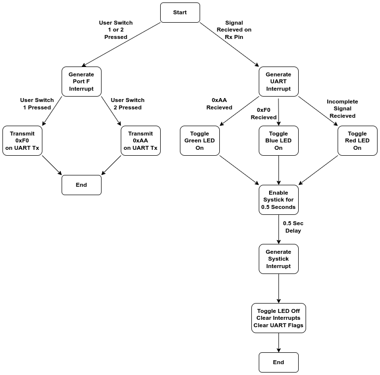
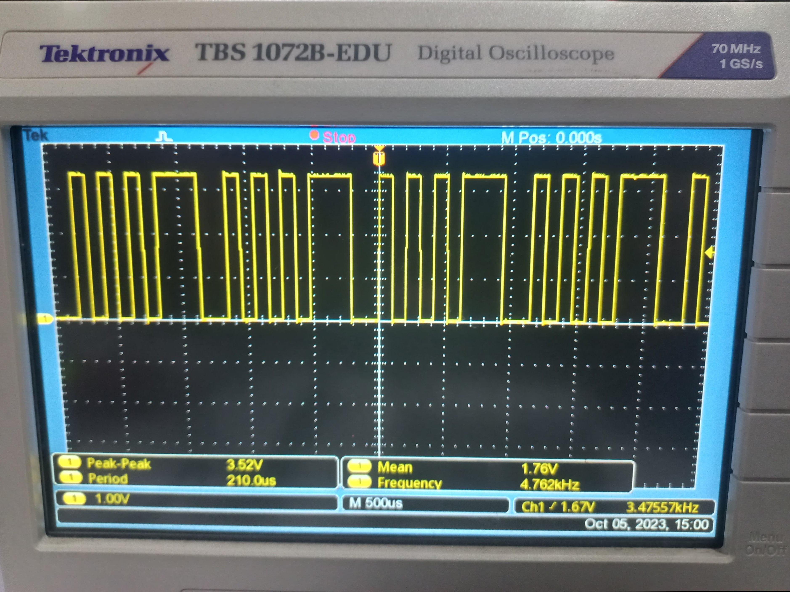
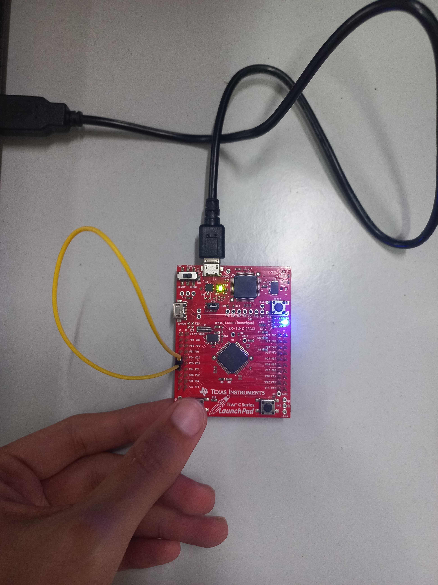
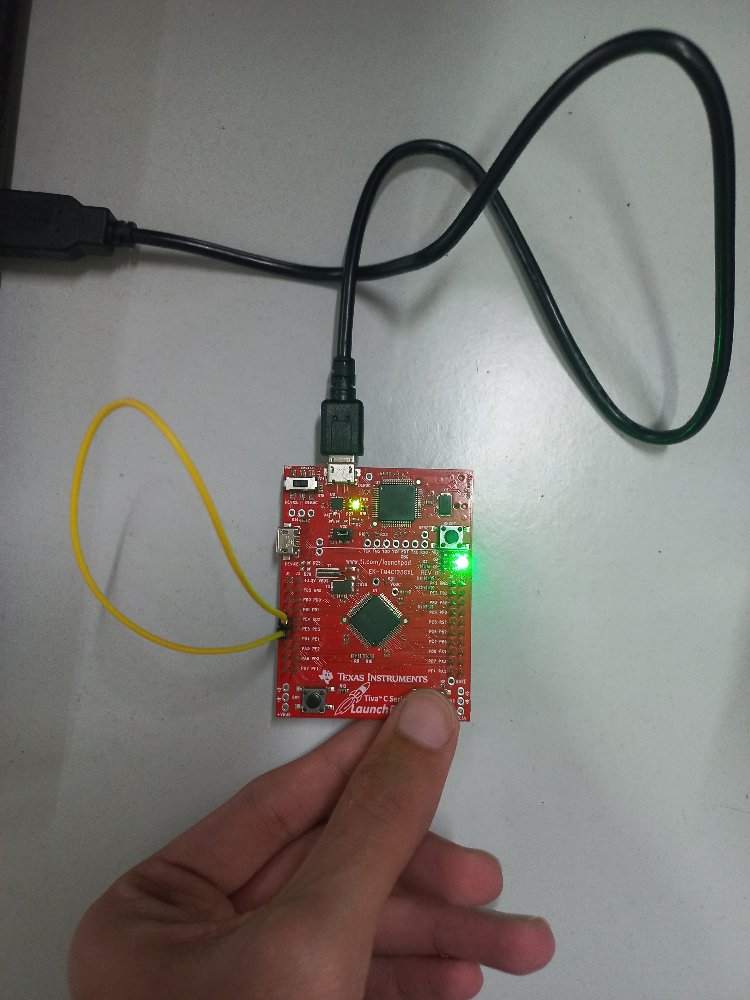
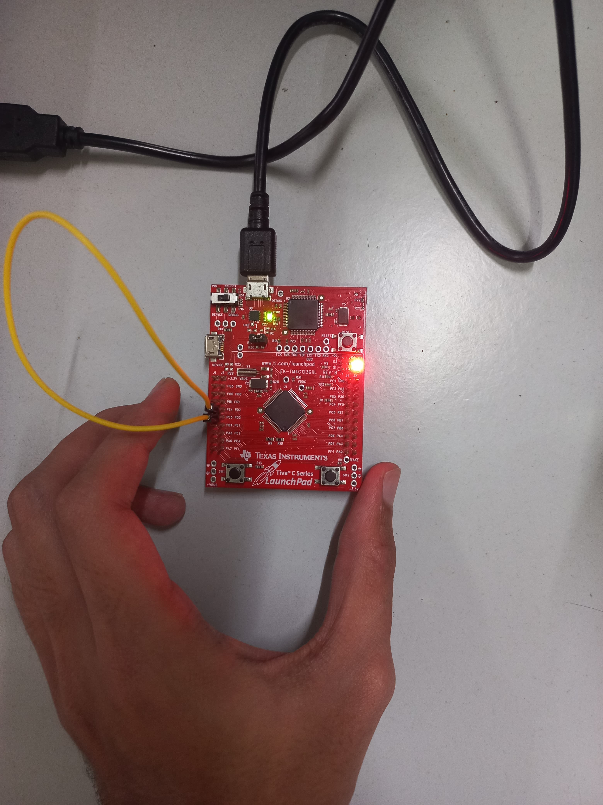

# Lab 8: UART implementation using TM4C123GH6PM microcontroller

Group 11: EE23DP001 Aditya Shirodkar; EE23MS006 Prasanth Pithanisetty

## Aim:
To implement UART based communication on the TM4C123GH6PM microcontroller and verify the same.
The program to be implemented is as follows:
* Configure the TM4C123GH6PM to enable UART communication at 9600 baud rate with odd parity
* If user switch 1 is pressed, 0xAA should be transmitted
* If user switch 2 is pressed, 0xF0 should be transmitted
* If 0xAA is recieved, Green LED should toggle ON
* If 0xF0 is recieved, Blue LED should toggle ON
* If any error is detected, Red LED should toggle ON

## Procedure:
1. Configure Port F such that both user switches serve as inputs and onboard LEDs serve as outputs.
2. Configure pins PE4 and PE5 of Port E, such that
	* PE4 serves as the Rx pin, PE5 serves as the Tx pin
3. Configure the appropriate registers of UART Module 5 (UART module correspondng to the required pins) to generated the required baud rate and implement odd parity.  
4. Enbale interrupts for both UART as well as user switches and assign appropriate priority levels to the same.
5. Configure Systick to toggle LED for desired duration before clearing interrupts.

## UART Protocol on TM4C123GH6PM:

## Algorithm:
The algorithm for implementing UART based task is depicted in the state diagram below:

*Stateflow diagram for UART application*

The use of interrupts and systick enables the processor to be available for additional tasks if necessary, as compared to polling based implementation.

## Code:

	/*
	* UART with baud rate 9600 and odd parity.
	* "F0" if SW1 is pressed
	* "AA" if SW2 is pressed
	* if "AA" is received LED should be GREEN;
	* if "F0" is recieved, the LED should be BLUE
	* if any error is detected LED should be RED
	*
	* Using PE4, PE5; UART Module 5
	* PE4 = Rx; PE5 = Tx
	*/

	#include <stdint.h>
	#include <stdbool.h>
	#include "tm4c123gh6pm.h"

	#define Sw_Bits 0x11
	#define S1_data 0xF0
	#define S2_data 0xAA

	#define Red 0X02
	#define Blue 0X04
	#define Green 0X08

	void PortF_Config(void);
	void UART_Config(void);
	void PortF_Handler(void);
	void UART_Handler(void);
	void Systick_Handler(void);

	#define STCTRL *((volatile long *) 0xE000E010)      //Control and Status Register
	#define STRELOAD *((volatile long *) 0xE000E014)   //SysTick Reload Value Register
	#define STCURRENT *((volatile long *) 0xE000E018)  //SysTick Current Value Register

	//Definitions to configure systick CSR(Control and Status Register)
	#define ENABLE (1<<0)       //bit 0 of CSR enables systick counter
	#define INT_EN (1<<1)       //bit 1 of CSR to generate interrupt to the NVIC when SysTick counts to 0
	#define Clk_SRC (1<<2)      //bit 2 of CSR to select system clock
	#define COUNT_FLAG (1<<16)  //bit 16 of CSR; The SysTick timer has counted to 0 since the last time this bit was read.

	void main(void)
	{
		SYSCTL_RCGCGPIO_R |= (1<<5);        //Enable and provide a clock to GPIO Port E
		SYSCTL_RCGCUART_R |= (1<<5);      //Enable and provide a clock to UART module 5 in Run mode
		SYSCTL_RCGCGPIO_R |= (1<<4);      //Enable and provide a clock to GPIO Port E

		UART_Config();
		PortF_Config();

		while(1){}
	}

	void PortF_Config(void)
	{
		GPIO_PORTF_LOCK_R = 0x4C4F434B;     //Unlock PortF register
		GPIO_PORTF_CR_R = 0x1F;             //Enable Commit function

		GPIO_PORTF_PUR_R = 0x11;            //Pull-up for user switches
		GPIO_PORTF_DEN_R = 0x1F;            //Enable all pins on port F
		GPIO_PORTF_DIR_R = 0x0E;            //Define PortF LEDs as output and switches as input

		//PortF Interrupt Configurations: User Sw should trigger hardware interrupt
		GPIO_PORTF_IS_R &= ~Sw_Bits;        //Edge trigger detected
		GPIO_PORTF_IBE_R &= ~Sw_Bits;       //Trigger interrupt according to GPIOIEV
		GPIO_PORTF_IEV_R &= ~Sw_Bits;       //Trigger interrupt on falling edge
		GPIO_PORTF_IM_R &= ~Sw_Bits;        //Mask interrupt bits
		GPIO_PORTF_ICR_R |= Sw_Bits;        //clear any prior interrupts
		GPIO_PORTF_IM_R |= Sw_Bits;         //enable interrupts for bits corresponding to Mask_Bits

		//NVIC Configuration
		//PortF interrupts correspond to interrupt 30 (EN0 and PRI7 registers)
		NVIC_EN0_R |= (1<<30);              //Interrupts enabled for port F
		NVIC_PRI7_R &= 0xFF3FFFFF;          //Interrupt Priority 1 to Port F
	}

	void UART_Config(void)
	{
		/*
		*BRDI = integer part of the BRD; BRDF = fractional part
		*BRD = BRDI + BRDF = UARTSysClk / (ClkDiv * Baud Rate)
		*UARTSysClk = 16MHz, ClkDiv = 16, Baud Rate = 9600
		*BRD = 104.167; BRDI = 104; BRDF = 167;
		*UARTFBRD[DIVFRAC] = integer(BRDF * 64 + 0.5) = 11
		*/
		UART5_CTL_R &= (0<<0);                       //Disable UART module 5
		UART5_IBRD_R = 104;
		UART5_FBRD_R = 11;
		UART5_CC_R = 0x00;                          //System Clock
		UART5_LCRH_R = 0x62;                        //8 bit word length, FIFO enable, Parity Enable
		UART5_CTL_R |= ((1<<0)|(1<<8)|(1<<9));      //Enable UART module 5

		//UART interrupt configuration
		UART5_IM_R &= ((0<<4)|(0<<5)|(0<<8));       //Mask Tx, Rx and Parity interrupts
		UART5_ICR_R &= ((0<<4)|(0<<5)|(0<<8));      //Clear Tx, Rx and Parity interrupts
		UART5_IM_R |= (1<<4);                       //Enable Rx interrupt
		NVIC_EN1_R |= (1<<29);                      //Interrupts enabled for UART5
		NVIC_PRI15_R &= 0xFFFF5FFF;                 //Interrupt Priority 2 to UART5

		GPIO_PORTE_LOCK_R = 0x4C4F434B;     //Unlock PortE register
		GPIO_PORTE_CR_R = 0xFF;             //Enable Commit function
		GPIO_PORTE_DEN_R = 0xFF;            //Enable all pins on port E
		GPIO_PORTE_DIR_R |= (1<<5);         //Define PE5 as output
		GPIO_PORTE_AFSEL_R |= 0x30;         //Enable Alternate function for PE4 and PE5
		//GPIO_PORTE_AMSEL_R = 0;
		GPIO_PORTE_PCTL_R |= 0x00110000;    //Selecting UART function for PD6 and PD7
	}

	void PortF_Handler()
	{
		GPIO_PORTF_IM_R &= ~Sw_Bits;

		if(GPIO_PORTF_RIS_R & 0x10)         //Usr Sw 1
		{
			UART5_DR_R = 0xF0;
		}
		else if (GPIO_PORTF_RIS_R & 0x01)   //Usr Sw 2
		{
			UART5_DR_R = 0xAA;
		}
	}

	void UART_Handler(void)
	{
		UART5_IM_R &= (0<<4);       //Mask UART Rx interrupt

		if(UART5_FR_R & (1<<6))    //Rx flag register set (data recieved)
		{
			if(UART5_DR_R == 0xAA)
			{
				GPIO_PORTF_DATA_R = Green;
			}
			else if(UART5_DR_R == 0xF0)
			{
				GPIO_PORTF_DATA_R = Blue;
			}
		}

		if(UART5_RSR_R & 0x0000000F)    //Any error detected
		{
			GPIO_PORTF_DATA_R = Red;
		}

		UART5_ECR_R &= 0xFFFFFFF0;        //Clear UART errors

		STCURRENT=0x00;                         //Reinitialise Systick Counter to Zero
		STRELOAD = 16*1000000/2;                //Run Systick for 0.5 second
		STCTRL |= (ENABLE | INT_EN | Clk_SRC);  //Enable Systick, Enable Interrupt Generation, Enable system clock (80MHz) as source

		GPIO_PORTF_ICR_R = Sw_Bits;
	}

	void Systick_Handler(void)
	{
		GPIO_PORTF_DATA_R &= 0x00;               //Turn off LED
		//mask, clear and unmask gpio interrupt
		GPIO_PORTF_ICR_R = Sw_Bits;
		GPIO_PORTF_IM_R |= Sw_Bits;
		UART5_IM_R |= (1<<4);                   //UnMask UART Rx interrupt
	}

## Results:
The operation of above algorithm is verified by connecting the Tx and Rx pins of port E, hence allowing for testing of both transmission as well as reception functionality of the program. LED behaviour using interrupts and systick is also verified.

The transmit logic performs parallel-to-serial conversion on the data read from the transmit FIFO. The control logic outputs the serial bit stream beginning with a start bit and followed by the data bits (LSB first), parity bit, and the stop bits according to the programmed configuration in the control registers. This is verified as shown below:

 * 0xAA is transmitted periodically from Tx pin, and captured on the oscilloscope.
 * 0xAA is 10101010 in binary
 * As the number of 1's in 10101010 is even, the parity bit should set to 1 to make the total number of 1's odd.
 * A single stop bit (1/High) is sent along with the data.
 * The data is sent LSB first, hence 01010101 is sent
 * Hence, the waveform to be observed would be 01010101_1_1 (DataBits_ParityBit_StopBit)

 

*0xAA transmitted and waveform captured on oscilloscope*

It is seen that the transmitted is signal aligns with the theoretically calculated signal.

*Pressing user switch 1, Tx and Rx of 0xF0, and glowing of Blue LED*

*Pressing user switch 2, Tx and Rx of 0xAA, and glowing of Green LED*

*Recieving noise/error signal, and glowing of Red LED*